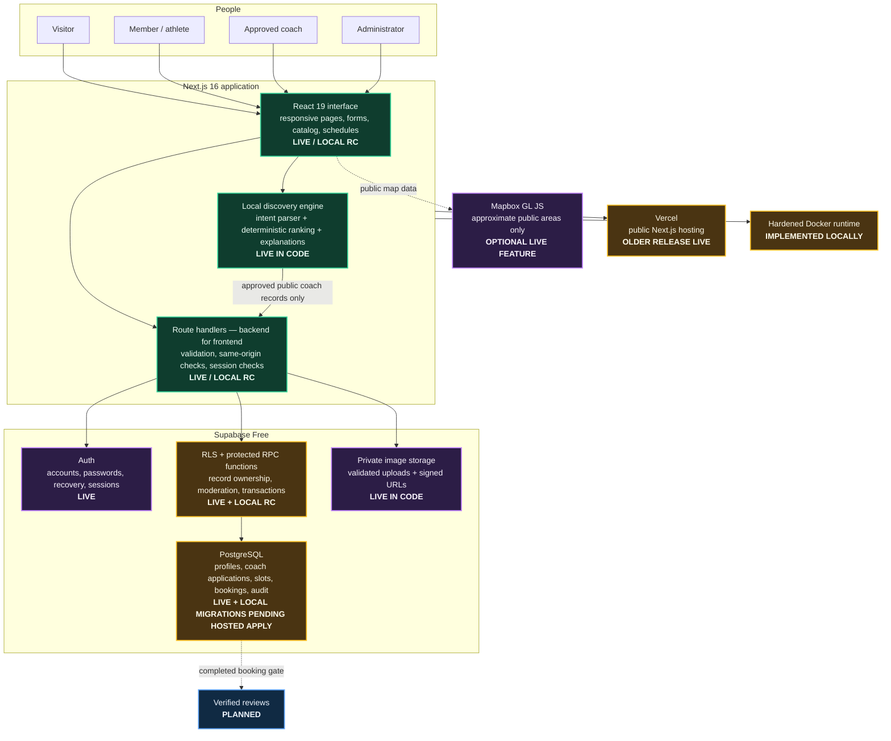
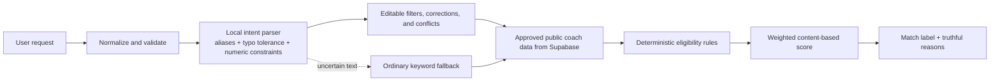
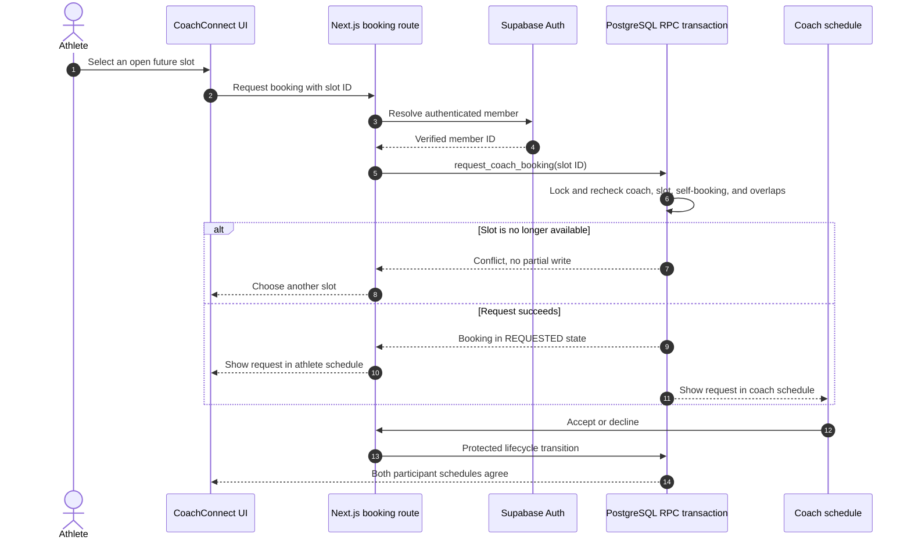

# CoachConnect Architecture and Product Specification

**Document status:** Maintained technical specification  
**Architecture view:** Current local implementation plus explicitly marked release gaps  
**Snapshot:** 2026-08-07 03:44 UTC  
**Product:** CoachConnect — zero-cost sports-coach marketplace for Pakistan

> **Status boundary:** This document describes the current local source tree. The public Vercel site at `https://coachconnect-sigma.vercel.app` may run an older release. Booking and availability are release-candidate features in local code, but their hosted Supabase migration and production end-to-end verification are still pending. Ratings and reviews are planned.

---

## 1. Product purpose

CoachConnect helps people find approved sports coaches, compare practical service details, and reserve one-to-one sessions. It is designed around four principles:

1. **The full approved catalog comes first.** Search and recommendations help people rank or narrow coaches, but never hide the complete marketplace.
2. **One identity can have several capabilities.** Every registered person is a member/athlete. The same account may gain approved coach capability and, through a protected process, administrator capability.
3. **Trust rules are enforced by the database.** The browser improves usability, but it is not trusted to authorize approval, booking, cancellation, or access to private data.
4. **The MVP costs Rs 0 to operate.** It avoids paid AI APIs, payment processing, queues, and unnecessary infrastructure.

### Launch baseline

- **Market:** Pakistan
- **Cities:** Karachi, Lahore, Islamabad, and Rawalpindi
- **Currency:** Pakistani rupees, displayed as `Rs 3,000`
- **Language:** English
- **Session types:** One-to-one online or in-person coaching
- **Payments:** Not collected by CoachConnect
- **Target operating cost:** Rs 0 using local development, Vercel free hosting, and Supabase Free
- **Safeguarding limit:** Real under-18 bookings must not launch until a guardian-managed safeguarding workflow exists

---

## 2. Product status matrix

| Capability | Status | Current boundary |
|---|---|---|
| Public home and coach catalog | **Live** | Approved coaches, filters, sorting, profiles, and optional approximate map |
| Account authentication | **Live** | Supabase email/password, password recovery, server-managed session cookies |
| Coach application and moderation | **Live** | Draft, submission, administrator decision, suspension, restoration, and audit events |
| Approved coach profile editing | **Live in current code** | Initial coach capability requires approval; later ordinary profile/image/schedule edits remain publishable unless suspended |
| Explainable recommendations | **Live in current code** | Deterministic content-based ranking with visible reasons and stable fallback ordering |
| Natural-language search | **Live in current code** | Local intent extraction, aliases, typo tolerance, conflict detection, budget/day parsing, and editable filters |
| Coach availability | **Release candidate verified locally** | Explicit slot management is implemented; recurring weekly rules and time-off exceptions remain planned; hosted database migration and live verification remain |
| Booking and cancellation | **Release candidate verified locally** | Request, accept/decline, cancellation, completion, schedules, private meeting details, and conflict protection; hosted migration and live verification remain |
| Ratings and verified reviews | **Planned** | Must be tied to a completed booking; no fabricated production ratings |
| Docker runtime | **Implemented locally** | Loopback-only hardened container workflow |
| Public deployment | **Older release live** | Vercel URL exists, but uncommitted local work is not represented until explicitly released and verified |
| Online payments, payouts, subscriptions | **Excluded** | Prices and refund-policy outcomes are recorded, but money is handled directly between member and coach |

---

## 3. Users and capabilities

### Visitor

- View the home page and full approved coach catalog.
- Search, sort, filter, and use natural-language discovery.
- View publication-safe coach profiles and future open slots.
- Register or sign in before requesting a booking.

### Member / athlete

Every registered account has athlete capability.

- Use visitor features.
- Request another coach's open slot.
- View and cancel their own bookings.
- Receive participant-only meeting details after confirmation.
- Eventually leave one verified review after a completed booking.
- Apply to become a coach without creating another account.

### Approved coach

Coach capability is additive; it does not replace athlete access.

- Maintain a public coaching profile and professional image.
- Publish service information, PKR price, formats, broad location, qualifications, and lesson details.
- Create and cancel future availability slots.
- Accept or decline booking requests.
- Add participant-only meeting instructions to confirmed bookings.
- Cancel or complete eligible bookings.
- Continue booking other coaches as an athlete.

### Administrator

Administrator capability cannot be selected during registration.

- Review new coach-capability applications.
- Approve, request changes, suspend, or restore coach capability.
- View audit information needed for moderation and support.
- Never approve or moderate their own coach application.

### Core authorization rules

- A coach cannot book their own slot.
- Registration cannot grant trusted coach or administrator capability.
- Coach suspension removes coach publication/actions but does not automatically remove athlete access.
- Account suspension is separate from coach suspension.
- Public responses do not disclose whether a missing coach is draft, rejected, or suspended.
- Private meeting details are visible only to booking participants.
- Direct browser access to booking and availability tables is denied; narrow database functions perform allowed operations.

---

## 4. System architecture



### Primary runtime flow

1. A browser requests a page from the Next.js application.
2. Server-rendered or interactive React components present the appropriate public or signed-in experience.
3. Mutating requests go through Next.js route handlers, which validate input, reject unsafe cross-origin requests, and verify the Supabase session.
4. Sensitive business operations call narrow PostgreSQL functions through Supabase RPC.
5. PostgreSQL Row-Level Security (RLS) and function logic enforce ownership, capability, lifecycle, and concurrency rules.
6. The database returns either a public-safe projection or a participant/owner-specific projection.
7. The UI displays a clear success, conflict, unavailable, or permission state.

**RLS definition:** Row-Level Security is a PostgreSQL feature that decides which individual records a signed-in person may read or change. It remains active even if someone bypasses the visible page and calls the backend directly.

---

## 5. Frontend specification

### Technology

- **Next.js 16 App Router** for pages, layouts, server rendering, route handlers, loading states, and production bundling.
- **React 19** for interactive catalog controls, account forms, booking controls, and schedules.
- **TypeScript 5** for explicit domain types and safer interface/API contracts.
- **Purpose-built CSS** in the application rather than a large component framework.
- **Mapbox GL JS** only for optional approximate-area visualization.

### Why Next.js and React

- One codebase can provide both the user interface and the thin server layer required to protect sessions and secrets.
- Server rendering improves initial load, direct profile links, and search-engine readability.
- Route handlers avoid adding a separate Express/FastAPI service for an MVP with one focused domain.
- Vercel supports Next.js directly on a free tier.
- React's component model fits reusable coach cards, filters, forms, booking panels, and schedule views.

### Why TypeScript

CoachConnect has lifecycle-heavy data: coach states, booking states, session modes, payment status, and role/capability combinations. TypeScript catches many mismatches before deployment and makes route payloads and UI states easier to review.

### Why custom CSS instead of a heavy UI framework

- The product needs a distinct sports-marketplace identity rather than a generic dashboard appearance.
- A small custom system reduces dependency weight and makes responsive behavior explicit.
- Accessibility states—labels, focus rings, reduced motion, keyboard order, and error text—remain under direct project control.

### Frontend responsibilities

- Present data and available actions based on server responses.
- Keep search interpretation visible and editable.
- Hide obviously invalid actions such as self-booking.
- Disable repeated submissions while a request is pending.
- Render loading, empty, conflict, unavailable, and unauthorized states clearly.
- Preserve privacy by never requesting or embedding private account fields on public pages.
- Never treat hidden buttons as authorization; the database remains authoritative.

### Responsive and accessibility requirements

- Target widths: 360 px, 768 px, and 1440 px.
- No horizontal scrolling in primary flows.
- Keyboard access for navigation, filters, forms, booking, and schedules.
- Visible focus styles and associated form labels.
- Motion respects `prefers-reduced-motion`.
- Images include meaningful alternative text or are marked decorative.
- Long names, missing images, empty states, and backend failures remain usable.

---

## 6. Backend and API specification

### Backend pattern: Backend for Frontend (BFF)

CoachConnect uses Next.js route handlers as a **Backend for Frontend**: a small server layer tailored to the web interface. It validates browser requests and forwards only authorized operations to Supabase.

Representative route groups:

- `/api/auth/*` — registration, login, logout, session, confirmation, and password recovery
- `/api/account` — private profile maintenance and account deletion
- `/api/coach-application` — draft, submission, and image handling
- `/api/admin/coach-applications` — protected moderation actions
- `/api/coaches` and `/api/coaches/[id]/availability` — public-safe catalog/profile availability
- `/api/bookings` and `/api/bookings/[id]` — booking lifecycle operations
- `/api/schedule` and `/api/schedule/slots` — participant schedules and coach inventory
- `/api/health` — process liveness
- `/api/ready` — dependency readiness, including public Supabase catalog access

### API responsibilities

1. Parse and validate input types, lengths, IDs, and allowed action names.
2. Reject unsafe cross-origin mutation requests.
3. Resolve the signed-in user through Supabase rather than trusting a client-supplied user ID.
4. Call a narrowly scoped Supabase query or RPC function.
5. Translate internal database errors into understandable, non-leaking HTTP responses.
6. Apply refreshed authentication cookies to the response.

### Why there is no separate microservice backend

A separate service would add deployment, networking, authentication, logging, and synchronization overhead without improving the current product. The modular monolith keeps domain boundaries in source code and database functions while remaining easy to test and deploy. A service split should occur only if measured load, team ownership, or independent scaling requires it.

---

## 7. Why Supabase was chosen

Supabase combines the backend capabilities required by CoachConnect while keeping the MVP within its Rs 0 constraint.

| Supabase capability | CoachConnect use | Reason for choosing it |
|---|---|---|
| Auth | Email/password identity, recovery, secure sessions | Avoids building and securing password storage and session rotation |
| PostgreSQL | Durable marketplace records | Strong relational constraints and transactions fit booking and moderation |
| Row-Level Security | Owner, participant, public, coach, and admin access rules | Authorization remains enforced at the data boundary |
| SQL functions / RPC | Approval and booking lifecycle transitions | Sensitive multi-step actions can be atomic and narrowly exposed |
| Storage | Coach profile images | Private objects, controlled upload paths, and signed read URLs |
| SQL migrations | Reproducible schema | Database design and security rules are reviewed and versioned with code |
| Free plan | Hosted MVP backend | Meets the explicit zero-cost requirement |

### Why Supabase instead of Firebase

Booking and moderation are relational and transaction-heavy. PostgreSQL provides explicit foreign keys, unique indexes, row locks, partial indexes, and SQL transactions that naturally express “one active booking per slot” and participant permissions. Firebase could support the product, but would require a less direct data model and more application-side transaction/security complexity.

### Why Supabase instead of a custom PostgreSQL server

A custom database plus authentication service would require server maintenance, password/session security, backups, networking, and deployment. Supabase provides these managed pieces while preserving standard PostgreSQL and portable SQL migrations.

### Free-plan limitation

A Supabase Free project may pause after inactivity and has finite database, storage, and bandwidth allowances. The application therefore has separate liveness/readiness checks, explicit unavailable states, efficient public projections, and no authorization to upgrade or spend money without approval.

---

## 8. Data and trust model

### Main records

| Record | Purpose | Visibility |
|---|---|---|
| `profiles` | One private member record per Supabase Auth identity | Owner and authorized administrator only |
| `coach_applications` | Coach profile, publication data, approval and suspension state | Owner/admin; approved subset exposed through public functions |
| `coach_moderation_events` | Auditable moderation history | Administrator only |
| `coach_profile_image_upload_limits` | Upload reservation/rate safety | Server/protected function only |
| `coach_availability_slots` | Coach-owned future inventory | Coach-owned; restricted public projection for open approved slots |
| `coach_bookings` | Athlete, coach, slot, lifecycle, price snapshot, cancellation and meeting details | Participants through restricted functions |
| `curated_demo_coaches` | Clearly labeled illustrative catalog records | Restricted public demo projection |
| Reviews table | One verified review per completed booking | **Planned** |

### Public projection rule

Public coach APIs return only approved, active, publication-safe fields. They omit:

- Login email and password/session data
- Personal phone number
- Exact home address or precise residential coordinates
- Private credential files
- Moderation notes and reviewer identity
- Participant-only meeting instructions

Unavailable profiles return the same not-found behavior whether they are missing, draft, rejected, or suspended, preventing moderation-state disclosure.

### Secret boundary

- Publishable Supabase and origin-restricted Mapbox browser keys may be used by the web client.
- Service-role keys and any secret provider tokens remain server-only and never enter browser bundles, public logs, or source control.
- Authentication sessions use server-managed HTTP-only cookies via `@supabase/ssr`.

---

## 9. Coach onboarding and moderation

### Lifecycle

```text
DRAFT → SUBMITTED → UNDER_REVIEW → APPROVED
                         └──────→ REJECTED / changes requested
APPROVED → SUSPENDED → APPROVED (restore)
```

### Design decision: approve capability once

The administrator approves the creation of coach capability, not every ordinary text or schedule edit. Once approved, a coach may keep their public profile current unless suspended. This avoids a moderation bottleneck and prevents harmless schedule/profile maintenance from disappearing while preserving administrator suspension and audit controls.

### Trust controls

- Application ownership is derived from the authenticated identity.
- Submission requires complete mandatory data.
- Only protected administrator operations may change trusted states.
- Self-review is rejected.
- Suspension is recorded and removes public coach capability without deleting the member account.
- Public visibility is derived from current approved/active state, not a browser flag.

---

## 10. AI and intelligent discovery design

CoachConnect currently uses two zero-cost intelligent systems. They are implemented locally and do not send user queries to a paid external model.

### 10.1 Natural-language search

Example input:

> `Beginner cricket coach in Lahore under Rs 5,000 on Saturday`

The local pipeline:

1. Normalizes case, spacing, punctuation, Unicode, and common currency forms.
2. Recognizes controlled aliases such as `LHR`, `KHI`, `soccer`, `ping pong`, and `personal trainer`.
3. Applies length-aware Damerau–Levenshtein matching for likely typos.
4. Extracts supported sport, city, level, format, budget, day, and goal/specialty tags.
5. Detects conflicting values rather than silently choosing one.
6. Keeps unknown terms as ordinary keywords.
7. Shows the interpretation as visible filters/corrections that the user can remove or change.
8. Searches only approved coach records returned by the database.

### 10.2 Explainable recommendations

A deterministic content-based scorer compares interpreted needs with coach facts:

- Sport eligibility
- Goal or specialty
- Athlete level
- City or online/in-person mode
- Maximum budget
- Listed availability
- Profile keyword overlap
- Stable neutral ordering as a final tie-breaker

The result uses labels such as **Strong match**, **Good match**, or **Possible match** and displays reasons generated from factors that were actually scored.

### AI flow



### Why this AI approach was chosen

- **Zero cost:** no API subscription or per-token fee.
- **Explainable:** every ranking reason maps to a known coach field and score factor.
- **Fast:** no network round-trip to a model provider.
- **Private:** search text remains inside the application.
- **Predictable:** the system cannot invent coaches, prices, credentials, ratings, or availability.
- **Testable:** fixed queries can assert extracted filters, conflicts, rankings, and explanations.
- **Resilient:** ordinary keyword search remains available if an interpretation is incomplete.

### Honest limitation

The current implementation is deterministic NLP and recommendation logic, not a trained machine-learning model or hosted LLM. It is still a meaningful intelligent feature, but an evaluator who explicitly requires a learned model may treat this as a rubric risk. A semantic model or provider should be added only after a representative evaluation set identifies failures that the local baseline cannot solve.

### AI safety boundary

AI/discovery logic cannot:

- Approve or suspend a coach
- Grant permissions
- Create or confirm a booking
- Access passwords, session tokens, private files, or exact addresses
- Invent a coach, qualification, rating, price, or available time
- Replace database eligibility or authorization rules
- Hide the complete approved catalog

### Evaluation requirements

Use a fixed test set containing clean queries, misspellings, abbreviations, local slang, incomplete requests, PKR variants, conflicting constraints, no-match cases, and suspended/unavailable records. Ranking quality must be evaluated against a representative multi-coach catalog, not one homogeneous fixture.

---

## 11. Availability and booking architecture

Availability and booking are treated as a transaction system, not merely a calendar interface.



### Booking lifecycle

```text
REQUESTED → CONFIRMED | DECLINED
REQUESTED | CONFIRMED → CANCELLED_BY_ATHLETE | CANCELLED_BY_COACH
CONFIRMED → COMPLETED after the session end
Past abandoned requests may become EXPIRED
```

### Conflict and retry safety

- A partial unique index allows only one active requested/confirmed booking per slot.
- Database functions lock and recheck state inside the transaction.
- Provider approval is rechecked when a request is accepted.
- Athlete schedule overlap is checked to prevent simultaneous sessions with different coaches.
- Coach slot overlap is rejected.
- Repeated or stale actions return truthful conflicts rather than creating duplicate state.
- The browser's availability display is advisory until PostgreSQL confirms the operation.

### Private fulfillment details

Only the coach may add exact meeting instructions or an online URL, and only after confirmation. The authenticated participant schedule may return these details; public coach and availability APIs must never include them.

### Payment and cancellation decision

`payment_status` remains `NOT_COLLECTED`. CoachConnect records the price snapshot and policy outcome but does not charge or refund anyone.

- Athlete cancels at least 24 hours before: `FULL_REFUND_DUE` if prepaid directly
- Athlete cancels within 24 hours: `OUTSIDE_FULL_REFUND_WINDOW`
- Coach cancellation: `FULL_REFUND_DUE` if prepaid directly

This language is intentionally honest: the coach, not CoachConnect, handles any direct refund.

---

## 12. External services and design decisions

### Mapbox

**Purpose:** Optional map visualization of broad public training areas.  
**Why chosen:** Mature browser map library, usable free allowance, and synchronized list/map interaction.  
**Privacy rule:** No home address or precise private GPS point. Online-only coaches are not pinned.  
**Fallback:** The catalog remains fully usable as a list if the map or token is unavailable.

### Vercel

**Purpose:** Public hosting for the Next.js application.  
**Why chosen:** Direct Next.js support, preview/build workflow, HTTPS, and a free tier.  
**Boundary:** Deployment does not migrate Supabase automatically unless the release process explicitly applies migrations. A successful Vercel build alone does not prove auth or booking works against production data.

### Docker

**Purpose:** Reproducible local release verification.  
**Why chosen:** Gives reviewers one consistent startup path independent of globally installed Node packages.  
**Hardening:** Loopback-only port binding, non-root Node user, read-only root filesystem, dropped Linux capabilities, and `no-new-privileges`.

### Prisma and SQLite

Prisma/SQLite belong to the original Phase 1 sample foundation and remain for isolated/local compatibility. Supabase PostgreSQL is the authoritative marketplace backend. New production marketplace features should not be split between two sources of truth.

### Services deliberately not chosen

- **Stripe/payment provider:** Pakistan availability, compliance, disputes, real charges, refunds, and webhook complexity exceed the MVP need.
- **Redis/cache:** No measured bottleneck currently justifies another stateful service.
- **Message queue:** Current operations are short and synchronous; no durable background workload requires one.
- **Paid LLM API:** Conflicts with Rs 0, adds latency/privacy/cost risk, and is not required for the explainable baseline.
- **Microservices:** Add operational complexity without a present scaling or ownership requirement.
- **Native mobile apps:** Responsive web covers the MVP audience with one codebase.

---

## 13. Reliability, performance, and scaling

### Current safeguards

- Public-safe database functions instead of exposing full tables.
- Dedicated profile routes load one coach rather than embedding every detail in the list.
- Stable coach ID tie-breakers prevent sorting from jumping unpredictably.
- Database constraints and transactions protect booking correctness.
- `/api/health` distinguishes process liveness from `/api/ready` dependency readiness.
- Clear service-unavailable responses when Supabase is paused or unreachable.
- Local image assets and validated profile uploads reduce unnecessary bandwidth and unsafe file handling.

### Growth plan

Before a large catalog launch:

1. Move public catalog filtering, sorting, and page boundaries fully server-side.
2. Add/verify indexes for publication state, sport, city, price, review summary, and next availability.
3. Load profile, reviews, and availability only on demand.
4. Maintain a small next-available summary for catalog sorting, then recheck the real slot transactionally.
5. Measure slow queries before adding caches.
6. Add structured operational monitoring only when it can remain within the cost limit.

---

## 14. Testing and quality gates

### Current verification snapshot

At the 2026-08-07 document check:

- `npm run lint` passed.
- `npm run typecheck` passed.
- `npm test` completed **198 of 204 tests successfully** across 38 files.
- One coach-profile test expects outdated demo lesson wording (`Focused batting drills`) while the current UI renders the revised `Focused skill work` copy.
- Five real Supabase integration cases failed while creating disposable users because Supabase Auth returned a retryable HTTP 500 (`AuthRetryableFetchError`). These same integration cases had passed immediately before this rerun, so the current result is recorded as an external/transient verification blocker rather than hidden as a pass.

This means the architecture document is verified and renderable, but the whole application test gate is **not currently green**.

### Automated checks

- **ESLint:** source-quality and framework rules
- **TypeScript:** static type checking with `tsc --noEmit`
- **Vitest:** domain, API, component, and migration contract tests
- **Testing Library:** user-facing React behavior
- **Supabase integration tests:** real Auth/RLS/RPC checks when explicit test credentials are provided
- **Next.js production build:** compilation and route bundling
- **npm audit:** high-severity dependency review
- **Docker startup and health/readiness:** release-runtime verification

### Trust-critical test coverage

- Cross-account and unauthenticated denial
- Coach self-approval and self-booking denial
- Suspended-coach publication and booking denial
- Simultaneous booking attempts with exactly one valid winner
- Participant-only meeting-detail access
- Cancellation policy boundaries, including exactly 24 hours
- Account deletion blocked by future active bookings and allowed after terminal states
- Public response checks for email, private location, moderation notes, and secrets
- Search typo/slang/conflict/no-match behavior
- Mobile, keyboard, loading, empty, and failure states

### Release gates

A release is not complete until:

1. Migrations apply cleanly to a disposable PostgreSQL/Supabase environment.
2. Lint, types, tests, build, and security audit pass.
3. Separate authenticated browser contexts prove the athlete and coach workflow.
4. Responsive and keyboard checks pass.
5. Docker starts successfully and readiness is healthy.
6. Hosted migrations are applied intentionally.
7. The production URL is tested end to end after deployment.
8. README, requirements, plan, scope, screens, and this specification agree.

---

## 15. Deployment architecture

### Local development

```text
Developer browser → Next.js dev server → Supabase project
                                └──────→ optional Mapbox tiles
```

### Local release verification

```text
Browser → 127.0.0.1:3000 → hardened Docker container → Supabase project
```

### Production

```text
User browser → Vercel HTTPS/CDN → Next.js pages and route handlers → Supabase Auth/PostgreSQL/Storage
                                                   └──────────────→ Mapbox public tiles
```

### Deployment truth rules

- Git source state, Vercel deployment state, and Supabase migration state are separate.
- “Built locally” does not mean deployed.
- “Deployed” requires a verified production URL and end-to-end behavior.
- No GitHub push, Vercel deployment, database migration, paid upgrade, or external service change occurs without explicit authorization.

---

## 16. Product exclusions and future options

### Explicitly excluded from the MVP

- Online payment collection, payouts, commissions, and subscriptions
- Native mobile applications
- In-app video, real-time chat, SMS, or WhatsApp
- Exact public addresses or residential GPS locations
- Group sessions and recurring packages
- Medical, physiotherapy, or rehabilitation advice
- AI-generated coach biographies
- Paid cloud or AI services

### Planned release work

1. Apply and verify availability/booking migrations in the hosted environment.
2. Complete production end-to-end booking verification.
3. Implement verified ratings and reviews tied to completed bookings.
4. Add recurring weekly availability and time-off exceptions; the current release candidate manages explicit slots.
5. Add the required Earliest availability catalog sort; the current sort options are Recommended, Rating, Price low-to-high, and Price high-to-low.
6. Move catalog filtering/sorting/pagination to server-side queries before inventory growth.
7. Add automated multi-user browser end-to-end coverage; current tests cover components, routes, SQL contracts, and real Supabase integration but no Playwright/Cypress suite exists.
8. Reconcile the older project report, stale phase text, and demo-catalog wording with current implementation status. The UI deliberately uses clearly labeled database demos and a bundled labeled fallback when the demo endpoint is unavailable.
9. Complete final mobile, keyboard, Docker, security, and five-minute demo gates.

### Optional later work

- AI-generated training plans after all mandatory marketplace features are complete
- Guardian-managed under-18 booking and safeguarding
- Real email notifications
- In-platform messaging
- Payment integration suitable for Pakistan
- Group coaching and packages
- Semantic model only if evaluation proves it materially improves discovery

---

## 17. Decision summary

CoachConnect is intentionally a **modular monolith**: one Next.js/React/TypeScript application, one Supabase backend, an optional Mapbox view, and two deployment paths (Vercel and Docker). This design was chosen because it is understandable, secure enough to enforce trust at the database boundary, inexpensive, and fast to test.

The most important architectural decisions are:

1. **One identity, multiple capabilities** instead of separate athlete and coach accounts.
2. **Supabase PostgreSQL + RLS + protected RPC** for durable authorization and conflict-safe booking.
3. **Next.js BFF route handlers** to keep browser-facing APIs and server-only security in one deployable application.
4. **Deterministic, explainable local AI** to meet discovery goals without paid APIs, hidden model behavior, or hallucinated marketplace facts.
5. **No payment collection** so the MVP can prove marketplace value without compliance and financial risk.
6. **Current-versus-production status honesty** so local release-candidate work is never mistaken for a verified live feature.

---

## 18. Source-of-truth map

- `PRODUCT_REQUIREMENTS.md` — required product behavior and quality bar
- `PLAN.md` — implementation order and verification gates
- `SCOPE.md` — accepted scope decisions and priority changes
- `README.md` — current status, setup, architecture summary, and commands
- `SCREEN_MAP.md` — routes and screen responsibilities
- `ARCHITECTURE_AND_PRODUCT_SPECIFICATION.md` — full product/system architecture and technology rationale
- `architecture/` — editable and rendered architecture diagrams
- `supabase/migrations/` — authoritative database schema, policies, functions, and constraints
- `src/lib/coach-discovery.ts` — natural-language interpretation and recommendation logic
- `src/lib/public-coaches.ts` — publication-safe coach projection
- `src/lib/scheduling.ts` — scheduling and booking domain types
- `src/app/api/` — server API boundaries
- `tests/` — behavior and security evidence
