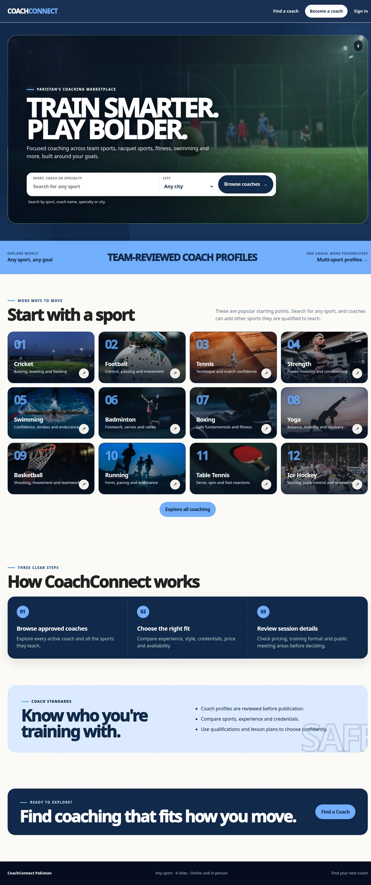
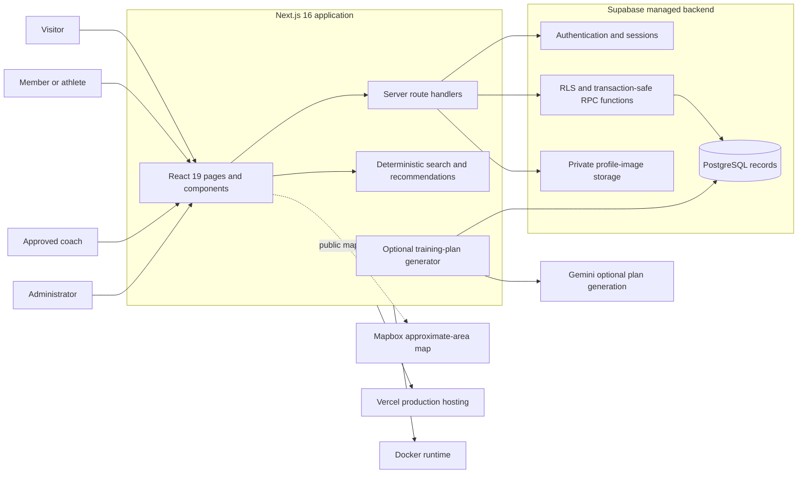
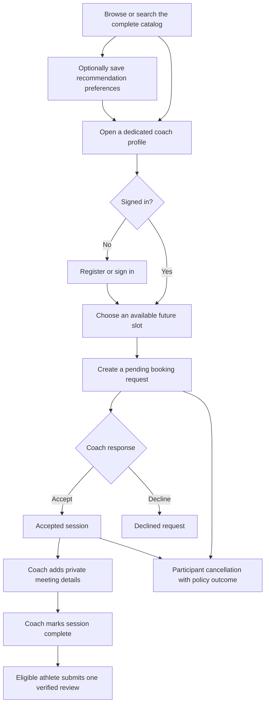
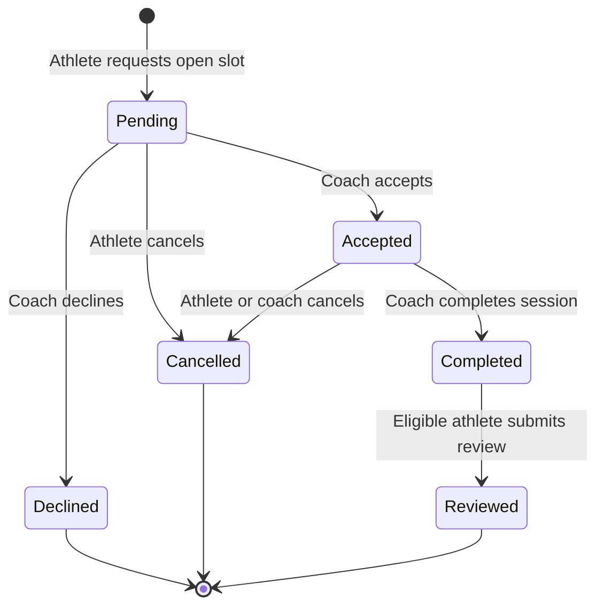

# CoachConnect

CoachConnect is a full-stack sports-coach marketplace MVP for adults in Pakistan. Members can discover coaches, save recommendation preferences, request sessions, manage schedules, and submit one verified review after a completed booking. A single account can use athlete features and separately apply for approved coach capability.

- **Live website:** <https://coachconnect-sigma.vercel.app>
- **Docker Hub:** <https://hub.docker.com/r/alimajid123/coachconnect>
- **Market:** Karachi, Lahore, Islamabad, and Rawalpindi
- **Currency:** Pakistani rupees (`Rs`)
- **Operating target:** Rs 0 using free-tier services

> This README describes the current source tree. A local change is not live on Vercel or GitHub until it is separately reviewed, published, and verified.

## Product screenshot

[](https://coachconnect-sigma.vercel.app)

The screenshot is a verified local production-container render of the current CoachConnect homepage.

## What the application does

| Area | Current behavior |
|---|---|
| Accounts | Supabase email/password authentication, recovery, secure server-managed sessions, account suspension, and self-service deletion |
| Coach discovery | Approved profiles plus clearly labeled demo profiles, filters, approximate map, dedicated profile routes, and typo-tolerant natural-language search |
| Recommendations | Deterministic ranking from saved sport, city, level, budget, and goal preferences; positive matches show visible reasons and `Recommended` labels |
| Coach onboarding | Draft, submission, administrator review, approval, requested changes, suspension, restoration, moderated public fields, profile images, and ad gallery |
| Availability | Approved coaches create and remove explicit future slots |
| Bookings | Conflict-safe request, acceptance, decline, cancellation, completion, participant schedules, and private meeting details |
| Notifications | Participant-bound Sessions updates with opaque, bounded browser read-state metadata |
| Reviews | One permanent verified review per completed booking; duplicate or edited reviews are database-blocked |
| Training plans | Optional Gemini-generated four-week plan with validation and a built-in fallback; plans remain private to the member |
| Payments | Demo accounting metadata only; CoachConnect does not collect, hold, refund, or transfer money |
| Deployment | Next.js on Vercel, hosted Supabase backend, and a public Linux `amd64` Docker image |

## Current system architecture



### How a request moves through the system

1. The browser receives a pre-rendered or server-rendered Next.js page.
2. React handles interactive search, filters, forms, schedules, and notifications.
3. Sensitive actions call same-origin Next.js route handlers instead of contacting privileged services directly.
4. The route validates input and checks the member's Supabase session.
5. PostgreSQL Row-Level Security (RLS) and narrow RPC functions enforce ownership, capability, lifecycle, and booking-conflict rules.
6. Private profile media is validated, normalized to WebP, stored in a private Supabase bucket, and returned through short-lived signed URLs.
7. Public responses contain only publication-safe coach data; participant-only details remain private.

**RLS** means PostgreSQL decides which individual records a person may access even if they bypass the visible interface.

Editable source: [`architecture/coachconnect-system-overview.mmd`](architecture/coachconnect-system-overview.mmd).

## Main marketplace flow



### Booking lifecycle



The database owns every booking transition. A unique active-slot rule and transactional RPC functions prevent two people from successfully reserving the same slot.

Detailed source: [`architecture/coachconnect-booking-flow.mmd`](architecture/coachconnect-booking-flow.mmd).

## Search, recommendations, and AI boundaries

Coach discovery does **not** depend on an AI provider:

1. Local code normalizes aliases, common spelling mistakes, budget phrases, days, levels, cities, formats, sports, and goals.
2. Explicit filters and interpreted fields remain editable.
3. Approved structured coach fields receive deterministic weights, with sport carrying the strongest influence.
4. Positive matches receive truthful reasons based on the factors actually scored.
5. The complete catalog remains available; approved real profiles take precedence over demos in fallback ordering.

Gemini is optional and used only for private training-plan generation. Inputs and structured output are validated, and a built-in four-week fallback is returned when Gemini is unavailable or invalid. Gemini cannot approve coaches, rank the catalog, book sessions, process money, change permissions, or access passwords.

Detailed source: [`architecture/coachconnect-ai-flow.mmd`](architecture/coachconnect-ai-flow.mmd).

## Data model

Supabase SQL migrations in `supabase/migrations/` create the production marketplace model.

| Table | Purpose and boundary |
|---|---|
| `profiles` | Private member identity metadata, account status, capabilities, preferences, and avatar path |
| `coach_applications` | Member-owned coach profile draft and moderation lifecycle |
| `coach_moderation_events` | Administrator decision history |
| `coach_availability_slots` | Explicit coach-owned future slots |
| `coach_bookings` | Booking lifecycle, meeting details, PKR price, demo payment status, and refund-policy outcome |
| `coach_reviews` | One verified immutable review per completed booking |
| `curated_demo_coaches` | Clearly labeled illustrative catalog records, separate from approved members |
| `training_plans` | Private member training plans |
| `coach_profile_image_upload_limits` | Persistent server-side media quota |
| `ai_training_plan_requests` | Private generation request history |
| `ai_discovery_request_quotas` | Legacy bounded AI-discovery quota retained by migrations; current catalog discovery is deterministic |

Important server-controlled functions include public coach projections, booking transitions, coach moderation, review submission, media reservation, demo accounting, and account deletion. Ordinary browser clients cannot grant themselves coach or administrator capability.

## Images and media

- Demo profiles use bundled illustrative files from `public/images/` and do not exercise the upload endpoint.
- Member avatars and coach-ad images use the private `coach-profile-images` Supabase Storage bucket.
- The server accepts JPEG, PNG, or WebP up to 5 MB, checks signatures and dimensions, fully decodes the image, strips metadata, resizes it, and stores normalized WebP bytes.
- Object paths are generated by the server, owner-scoped, immutable, and quota-limited.
- The Supabase service-role key is server-only. It must be available to Vercel or the local server for uploads and account image cleanup, but must never enter browser code, Git, Docker layers, screenshots, or chat.

## Repository structure

```text
coachconnect/
├── src/app/                  Next.js pages, layouts, and 22 server API routes
├── src/components/           Shared navigation, catalog, map, booking, and schedule UI
├── src/lib/                  Validation, discovery, recommendation, Supabase, and domain helpers
├── supabase/migrations/      18 ordered PostgreSQL, RLS, Storage, and RPC migrations
├── tests/                    Unit, component, migration-contract, route, and live RLS tests
├── public/                   Production brand, licensed/approved media, and static demo imagery
├── architecture/             Editable current Mermaid architecture and feature flows
├── docs/media/               Optimized README media
├── prisma/                   Legacy Phase-1 SQLite sample model, retained until coordinated removal
├── Dockerfile                Multi-stage production image
├── compose.yaml              Hardened loopback-only local container
├── .dockerignore             Excludes secrets, caches, and development-only files
├── .env.example              Safe environment-variable template
├── PRODUCT_REQUIREMENTS.md   Product and quality requirements
├── PLAN.md                   Delivery order and verification gates
├── SCOPE.md                  Scope decisions and priority changes
└── SCREEN_MAP.md             Route and screen responsibilities
```

Prisma and SQLite are legacy compatibility pieces. Removing them requires one coordinated change across `prisma/`, `prisma.config.ts`, `src/lib/coach-repository.ts`, tests, package dependencies, lockfile, scripts, and `Dockerfile`. Do not delete only the `prisma/` directory.

## User-facing routes

| Route | Purpose |
|---|---|
| `/` | Public marketplace landing page |
| `/coaches` | Searchable coach catalog, recommendations, filters, and optional map |
| `/coaches/[id]` | Dedicated publication-safe coach profile and booking entry point |
| `/recommendations` | Saved recommendation settings |
| `/account` | Authentication, member profile, avatar, and account controls |
| `/coach/apply` | Coach application and ad-image workflow |
| `/admin/coaches` | Protected coach moderation queue |
| `/sessions` | Athlete and coach bookings, availability, meeting details, review eligibility, and demo accounting |
| `/training-plans` | Private optional generated/fallback plans |

The server API lives under `src/app/api/`. `/api/health` checks process liveness; `/api/ready` also verifies the required public Supabase catalog contract.

## Technology

| Layer | Technology |
|---|---|
| Web application | Next.js 16 App Router, React 19, TypeScript 5 |
| Styling | Purpose-built responsive CSS |
| Authentication | Supabase Auth with `@supabase/ssr` and HTTP-only session cookies |
| Database | Hosted Supabase PostgreSQL with RLS and transaction-safe RPC functions |
| Private files | Supabase Storage with signed URLs |
| Maps | Mapbox GL JS with an origin-restricted public token |
| Optional generation | Google Gemini with deterministic fallback |
| Tests | Vitest, Testing Library, jsdom, and real Supabase integration probes |
| Local packaging | Docker multi-stage build and Docker Compose |
| Hosting | Vercel plus Docker Hub |

## Environment variables

Copy `.env.example` to an ignored `.env.local`. Never commit populated environment files.

| Variable | Exposure | Required for |
|---|---|---|
| `SUPABASE_URL` | Server | Authentication, database, and Storage project location |
| `SUPABASE_PUBLISHABLE_KEY` | Publishable | Public and signed-in Supabase requests |
| `SUPABASE_SERVICE_ROLE_KEY` | **Server secret** | Validated media writes, image cleanup, administrator integration tests |
| `NEXT_PUBLIC_MAPBOX_ACCESS_TOKEN` | Browser-publishable and origin-restricted | Map view; must be present when the Next.js bundle is built |
| `GEMINI_API_KEY` | **Server secret**, optional | Optional training-plan generation |
| `SUPABASE_INTERNAL_URL` | Server, optional | Docker reaching a separately hosted/local Supabase API |

Do not prefix server secrets with `NEXT_PUBLIC_`.

## Local development

Requirements: Node.js 22+, npm, and access to a Supabase project.

```bash
npm ci
cp .env.example .env.local
# Fill the required values without committing the file.
npm run dev
```

Open <http://127.0.0.1:3000>.

### Supabase setup

```bash
npx supabase login
npx supabase link --project-ref YOUR_PROJECT_REF
npx supabase db push
```

In **Supabase Dashboard → Authentication → URL Configuration** configure:

- Production Site URL: `https://coachconnect-sigma.vercel.app`
- Production callback: `https://coachconnect-sigma.vercel.app/auth/callback`
- Local callback: `http://localhost:3000/auth/callback`

For the current Rs 0 MVP, email confirmation may be disabled so registration does not depend on custom SMTP. Do not treat Supabase's default email sender as production-grade delivery.

### Administrator bootstrap

Registration cannot grant administrator capability.

1. Register a dedicated member account.
2. Copy its UUID from **Authentication → Users**.
3. In **Table Editor → public → profiles**, change only that account's `role` to `ADMIN`.
4. Sign in with the separate administrator account and open `/admin/coaches`.

Self-review is blocked by the database.

## Verification

Run the canonical gate before committing or packaging a release:

```bash
npm run check
npm audit --audit-level=high
```

`npm run check` executes lint, TypeScript, all Vitest suites, the configured real Supabase integration tests, and a production Next.js build.

Focused operational probes:

```bash
curl -fsS http://127.0.0.1:3000/api/health
curl -fsS http://127.0.0.1:3000/api/ready
```

The live RLS integration suite provisions confirmed disposable identities with the server-only test key and guarantees cleanup. Never run it against an unintended project.

## Docker

Docker packages the CoachConnect web server and production dependencies. It does **not** contain member records, Supabase, Gemini, secret keys, or the Vercel deployment.

### Run the published image on Ubuntu

```bash
docker pull alimajid123/coachconnect:latest
nano .env.local
# Add your own SUPABASE_URL and SUPABASE_PUBLISHABLE_KEY.
# Add SUPABASE_SERVICE_ROLE_KEY only when secure uploads/account cleanup are required.
docker run -d \
  --name coachconnect \
  -p 127.0.0.1:3000:3000 \
  --env-file .env.local \
  alimajid123/coachconnect:latest
curl -fsS http://127.0.0.1:3000/api/health
```

Open <http://127.0.0.1:3000>.

The published image currently targets Linux `amd64`. Its Mapbox view is unavailable because `NEXT_PUBLIC_*` browser values are embedded during image build. Build from source when a Mapbox token is required.

```bash
docker logs -f coachconnect
docker stop coachconnect
docker rm coachconnect
```

### Build from source with Compose

Place `NEXT_PUBLIC_MAPBOX_ACCESS_TOKEN` in `.env.local` **before** building if maps are required. This browser-publishable value is embedded into the client bundle during the Next.js build; `docker run` cannot add it later.

```bash
docker compose config --quiet
docker compose up --build -d
docker compose ps
curl -fsS http://127.0.0.1:3000/api/health
docker compose logs -f web
docker compose down
```

Compose binds only `127.0.0.1:3000`, runs as the non-root `node` user, uses a read-only root filesystem, drops Linux capabilities, enables `no-new-privileges`, and applies CPU, memory, process, and temporary-filesystem limits.

### When the Docker image must be updated

Rebuild and republish Docker when runtime source, dependencies, `Dockerfile`, Next.js build-time configuration, or public assets change. A Vercel-only secret rotation does **not** require a Docker rebuild. Documentation-only edits also do not change runtime behavior, but publishing a new source release should normally include a matching immutable Docker tag for reproducibility.

Never copy `.env.local` into the image or share it with recipients.

## Security and privacy boundaries

- Passwords are handled by Supabase Auth and are never stored by CoachConnect.
- Mutating APIs reject unsafe cross-origin requests and verify the signed-in member.
- Browser controls improve usability but never provide authorization by themselves.
- Public profiles omit email, exact home address, private residential location, and exact GPS information.
- Map markers use broad public areas only; participant meeting details remain booking-private.
- Direct browser writes to private media are denied; server validation precedes Storage access.
- Account and coach capabilities are separate. An approved coach remains an athlete, and registration cannot self-grant approval or administration.
- Self-booking, self-review, self-approval, duplicate active-slot booking, and duplicate review submission are blocked at trusted boundaries.
- No raw account or booking identifiers are persisted for notification read state in browser storage.

## Payments and refunds

CoachConnect has no real payment processor. The demo checkout may accept obvious test-card fields in temporary browser state, but those fields are not sent to or stored by the server.

Booking-level accounting metadata is stored in `public.coach_bookings`, including:

- `price_pkr`
- `payment_status`
- `payment_recorded_at`
- `refunded_at`
- `refund_policy_outcome`

Weekly, monthly, pending, and lifetime totals are derived from booking rows rather than stored in a wallet. Athletes arrange actual payment directly with coaches, and CoachConnect cannot issue real refunds.

## Documentation governance

- `README.md`: concise current implementation, architecture, setup, security, testing, and release guidance
- `PRODUCT_REQUIREMENTS.md`: authoritative product and quality requirements
- `PLAN.md`: delivery order, architecture decisions, and verification gates
- `SCOPE.md`: scope decisions and priority history
- `SCREEN_MAP.md`: routes and screen responsibilities
- `ARCHITECTURE_AND_PRODUCT_SPECIFICATION.md`: detailed dated architecture/product snapshot; consult README for current release status
- `architecture/*.mmd`: editable current diagrams
- `docs/`: generated reports and optimized README media

Every behavior change should update affected documentation in the same reviewed change. Use explicit status language and never imply that local work is already present on GitHub, Docker Hub, or Vercel.

## Current limitations

- Online payment processing, payouts, subscriptions, group sessions, and recurring packages are excluded.
- Real under-18 bookings require a guardian-managed safeguarding design before launch.
- Availability uses explicit slots rather than recurring weekly rules and time-off exceptions.
- The public Docker image is Linux `amd64` only and cannot receive a Mapbox browser token at runtime.
- Prisma/SQLite remains as legacy Phase-1 compatibility until a coordinated tested removal.
- Production image upload acceptance requires a real signed-in owner test; anonymous health checks cannot prove a member upload journey.
